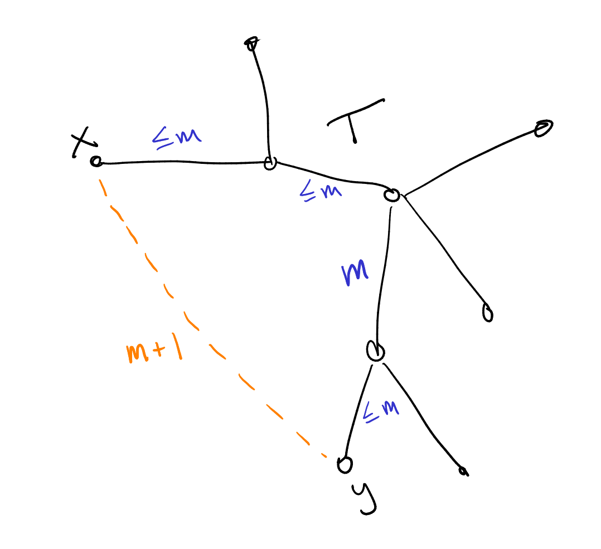
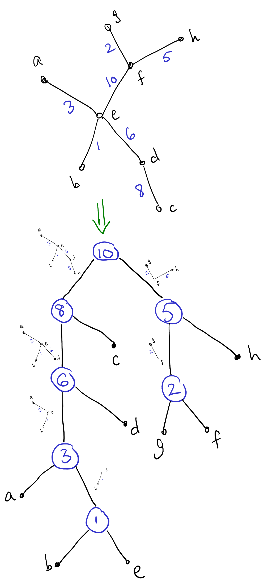

In my [previous
post](https://byorgey.github.io/blog/posts/2024/11/02/UnionFind.html)
I explained how to implement a reasonably efficient *union-find* data
structure in Haskell, and challenged you to solve a couple Kattis
problems.  In this post, I will (1) touch on a few generalizations
brought up in the comments of my last post, (2) go over my solutions
to the two challenge problems, and (3) briefly discuss generalizing
the second problem's solution to finding max-edge decompositions of
weighted trees.

Generalizations
---------------

Before going on to explain my solutions to those problems, I want to
highlight some things from a [comment by Derek
Elkins](https://byorgey.github.io/blog/posts/2024/11/02/UnionFind.html#isso-1971)
and a related [blog post by Philip
Zucker](https://www.philipzucker.com/union-find-groupoid/).  The first
is that instead of (or in addition to) annotating each set with a
value from a commutative semigroup, we can also annotate the *edges*
between nodes with elements from a
[group](https://en.wikipedia.org/wiki/Group_(mathematics)) (or, more
generally, a [groupoid](https://en.wikipedia.org/wiki/Groupoid)).  The
idea is that each edge records some information about, or evidence
for, the *relationship* between the endpoints of the edge.  To compute
information about the relationship between two arbitrary nodes in the
same set, we can compose elements along the path between them.  This
is a nifty idea---I have never personally seen it used for a
competitive programming problem, but it probably has been at some
point. (It kind of makes me want to write such a problem!) And of
course it has "real" applications beyond competitive programming as
well.  I have not actually generalized my union-find code to allow
edge annotations; I leave it as an exercise for the reader.

\newcommand{\create}{\mathit{create}}
\newcommand{\find}{\mathit{find}}
\newcommand{\union}{\mathit{union}}

The other idea to highlight is that instead of thinking in terms of
*disjoint sets*, what we are really doing is building an [*equivalence
relation*](https://www.jonmsterling.com/jms-00L3.xml), which
partitions the elements into disjoint equivalence classes.  In
particular, we do this by incrementally building a relation $R$, where
the union-find structure represents the reflexive, transitive,
symmetric closure of $R$. We start with the empty relation $R$ (whose
reflexive, transitive, symmetric closure is the discrete equivalence
relation, with every element in its own equivalence class); every
$\union(x,y)$ operation adds $(x,y)$ to $R$; and the $\find(x)$
operation computes a canonical representative of the equivalence class
of $x$.  In other words, given some facts about which things are
related to which other things (possibly along with some associated
evidence), the union-find structure keeps track of everything we can
infer from the given facts and the assumption that the relation is an
equivalence.

Finally, through the comments I also learned about other
potentially-faster-in-practice schemes for doing path compression such
as [Rem's
Algorithm](https://algocoding.wordpress.com/2015/05/13/simple-union-find-techniques/);
I leave it for future me to try these out and see if they speed things up.

Now, on to the solutions!

Duck Journey
------------

In [Duck Journey](https://open.kattis.com/problems/andvag), we are
essentially given a graph with edges labelled by bitstrings, where
edges along a path are combined using bitwise OR.  We are then asked
to find the *greatest* possible value of a path between two given
vertices, assuming that we are allowed to retrace our steps as much as
we want.^[Incidentally, if we are *not* allowed to retrace our steps,
this problem probably becomes NP-hard.] If we can retrace our steps,
then on our way from A to B we might as well visit every edge in the
entire connected component, so this problem is not really
about path-finding at all.  It boils down to two things: (1) being
able to quickly test whether two given vertices are in the same
connected component or not, and (2) computing the bitwise OR of all
the edge labels in each connected component.

One way to solve this would be to first use some kind of graph
traversal, like DFS, to find the connected components and build a map
from vertices to component labels; then partition the edges by
component and take the bitwise OR of all the edge weights in each
component.  To answer queries we could first look up the component
label of the two vertices; if the labels are the same then we look up
the total weight for that component.

This works, and is in some sense the most "elemantary" solution, but
it requires building some kind of graph data structure, storing all
the edges in memory, doing the component labelling via DFS and
building another map, and so on.  An alternative solution is to use a
union-find structure with a bitstring annotation for each set: as we
read in the edges in the input, we simply union the endpoints of the
edge, and then update the bitstring for the resulting equivalence
class with the bitstring for the edge. If we take a union-find library
as given, this solution seems simpler to me.

First, some imports and the top-level `main` function. ([See here for the `ScannerBS` module](https://github.com/byorgey/comprog-hs/blob/master/ScannerBS.hs).)

```haskell
{-# LANGUAGE ImportQualifiedPost #-}
{-# LANGUAGE OverloadedStrings #-}
{-# LANGUAGE RecordWildCards #-}

module Main where

import Control.Category ((>>>))
import Control.Monad.ST
import Data.Bits
import Data.ByteString.Lazy.Char8 (ByteString)
import Data.ByteString.Lazy.Char8 qualified as BS

import ScannerBS
import UnionFind qualified as UF

main = BS.interact $ runScanner tc >>> solve >>> format

format :: [Maybe Int] -> ByteString
format = map (maybe "-1" (show >>> BS.pack)) >>> BS.unlines
```

Next, some data types to represent the input, and a `Scanner` to read
it.

```haskell
-- Each edge is a "filter" represented as a bitstring stored as an Int.
newtype Filter = Filter Int
  deriving (Eq, Show)

instance Semigroup Filter where
  Filter x <> Filter y = Filter (x .|. y)

filterSize :: Filter -> Int
filterSize (Filter f) = popCount f

data Channel = Channel UF.Node UF.Node Filter deriving (Eq, Show)
data TC = TC {n :: !Int, channels :: [Channel], queries :: [(Int, Int)]}
  deriving (Eq, Show)

tc :: Scanner TC
tc = do
  n <- int
  m <- int
  q <- int
  channels <- m >< (Channel <$> int <*> int <*> (Filter <$> int))
  queries <- q >< pair int int
  return TC {..}
```

Finally, here's the solution itself: process each channel with a
union-find structure, then process queries.  The annoying thing, of
course, is that this all has to be in the `ST` monad, but other than
that it's quite straightforward.

```haskell
solve :: TC -> [Maybe Int]
solve TC {..} = runST $ do
  uf <- UF.new (n + 1) (Filter 0)
  mapM_ (addChannel uf) channels
  mapM (answer uf) queries

addChannel :: UF.UnionFind s Filter -> Channel -> ST s ()
addChannel uf (Channel a b f) = do
  UF.union uf a b
  UF.updateAnn uf a f

answer :: UF.UnionFind s Filter -> (Int, Int) -> ST s (Maybe Int)
answer uf (a, b) = do
  c <- UF.connected uf a b
  case c of
    False -> pure Nothing
    True -> Just . filterSize <$> UF.getAnn uf a
```

Inventing Test Data
-------------------

In [Inventing Test Data](https://open.kattis.com/problems/inventing),
we are given a tree $T$ with integer weights on its edges, and asked
to find the minimum possible weight of a complete graph for which $T$
is the unique [minimum spanning
tree](https://en.wikipedia.org/wiki/Minimum_spanning_tree) (MST).

^[{-} ]

Let $e = (x,y)$ be some edge which is not in $T$.  There must be a
unique path between $x$ and $y$ in $T$ (so adding $e$ to $T$ would
complete a cycle); let $m$ be the maximum weight of the edges along
this path.  Then I claim that we must give edge $e$ weight $m+1$:

- On the one hand, this ensures $e$ can never be in any MST, since an
  edge which is strictly the largest edge in some cycle can never be
  part of an MST (this is often called the "cycle property").
- Conversely, if $e$ had a weight less than or equal to $m$, then $T$
  would not be a MST (or at least not uniquely): we
  could remove any edge in the path from $x$ to $y$ through $T$ and
  replace it with $e$, resulting in a spanning tree with a lower (or
  equal) weight.

Hence, every edge not in $T$ must be given a weight one more than the
largest weight in the unique $T$-path connecting its endpoints; these
are the minimum weights that ensure $T$ is a unique MST.

A false start
-------------

At first, I thought what we needed was a way to quickly compute this
max weight along any path in the tree (where by "quickly" I mean
something like "faster than linear in the length of the path").  There
are indeed ways to do this, for example, using a heavy-light
decomposition and then putting a data structure on each heavy path
that allows us to query subranges of the path quickly.  (If we use a
segment tree on each path we can even support operations to *update*
the edge weights quickly.)

All this is fascinating, and something I
may very well write about later.  But it doesn't actually help!  Even
if we could find the max weight along any path in $O(1)$, there are
still $O(V^2)$ edges to loop over, which is too big.  There can be up
to $V = 15\,000$ nodes in the tree, so $V^2 = 2.25 \times 10^8$.  A
good rule of thumb is $10^8$ operations per second, and there are
likely to be very high constant factors hiding in whatever complex
data structures we use to query paths efficiently.

So we need a way to somehow process many edges at once.  As usual, a
change in perspective is helpful; to get there we first need to take a
slight detour.

Kruskal's Algorithm
-------------------

It helps to be familiar with [Kruskal's
Algorithm](https://en.wikipedia.org/wiki/Kruskal%27s_algorithm), which
is the simplest algorithm I know for finding minimum spanning
trees:

- Sort the edges from smallest to biggest weight.
- Initialize $T$ to an empty set of edges.
- For each edge $e$ in order from smallest to biggest:
    - If $e$ does not complete a cycle with the other edges already in
      $T$, add $e$ to $T$.

To efficiently check whether $e$ completes a cycle with the other
edges in $T$, we can use a union-find, of course: we maintain
equivalence classes of vertices under the "is connected to"
equivalence relation; adding $e$ would complete a cycle if and only if
the endpoints of $e$ are already connected to each other in $T$.  If
we do add an edge $e$, we can just $\union$ its endpoints to properly
maintain the relation.

A change of perspective
-----------------------

So how does this help us solve "Inventing Test Data"?  After all, we
are not being directly asked to find a minimum spanning tree.
However, it's still helpful to think about the process Kruskal's
Algorithm *would* go through, in order to choose edge weights that
will force it to do what we want (*i.e.* pick all the edges in $T$).
That is, instead of thinking about each individual edge *not* in $T$,
we can instead think about the edges that *are* in $T$, and what must
be true to force Kruskal's algorithm to pick each one.

Suppose we are part of the way through running Kruskal's algorithm,
and that it is about to consider a given edge $e = (x,y) \in T$ which
has weight $w_e$.  At this point it has already considered any edges
with smaller weight, and (we shall assume) chosen all the
smaller-weight edges in $T$.  So let $X$ be the set of vertices
reachable from $x$ by edges in $T$ with weight less than or equal to
$w_e$, and similarly let $Y$ be those reachable from $y$.  Kruskal's
algorithm will pick edge $e$ after checking that $X$ and $Y$ are
disjoint.

^[{-} ]

Think about all the *other* edges from $X$ to $Y$: all of them must
have weight greater than $w_e$, because otherwise Kruskal's algorithm
would have already considered them earlier, and used one of them to
connect $X$ and $Y$.  In fact, *all* of these edges must have weight
$w_e + 1$, as we argued earlier, since $e$ is the largest-weight edge
on the $T$-path between their endpoints (all the other edges on these
paths were already chosen earlier and hence have smaller weight).  The
number of such edges is just $|X| |Y| - 1$ (there is an edge for every
pair of vertices, but we do not want to count $e$ itself).  Hence they
contribute a total of $(|X||Y| - 1)(w_e + 1)$ to the sum of edge
weights.

Hopefully the solution is now becoming clear: we process the edges of
$T$ in order from smallest to biggest, using a union-find to keep
track equivalence classes of connected vertices so far.  For each edge
$(x,y)$ we look up the sizes of the equivalence classes of $x$ and
$y$, add $(|X||Y| - 1)(w_e + 1)$ to a running total, and union.  This
accounts for all the edges not in $T$; finally we must also add the
weights of the edges in $T$ themselves.

First some standard pragmas and imports, along with some data types
and a `Scanner` to parse the input.  Note the custom `Ord` instance
for `Edge`, so we can sort edges by weight.

```haskell
{-# LANGUAGE ImportQualifiedPost #-}
{-# LANGUAGE RecordWildCards #-}

import Control.Category ((>>>))
import Control.Monad.ST
import Data.ByteString.Lazy.Char8 qualified as BS
import Data.List (sort)
import Data.Ord (comparing)
import Data.STRef
import ScannerBS
import UnionFind qualified as UF

main = BS.interact $ runScanner (numberOf tc) >>> map (solve >>> show >>> BS.pack) >>> BS.unlines

data Edge = Edge {a :: !Int, b :: !Int, w :: !Integer}
  deriving (Eq, Show)

instance Ord Edge where
  compare = comparing w

data TC = TC {n :: !Int, edges :: [Edge]}
  deriving (Eq, Show)

tc :: Scanner TC
tc = do
  n <- int
  edges <- (n - 1) >< (Edge <$> int <*> int <*> integer)
  return TC {..}
```

Finally, the (remarkably short) solution proper: we `sort` the edges
and process them from smallest to biggest; for each edge we update an
accumulator according to the formula discussed above.  Since we're
already tied to the `ST` monad anyway, we might as well keep the
accumulator in a mutable `STRef` cell.

```haskell
solve :: TC -> Integer
solve TC {..} = runST $ do
  uf <- UF.new (n + 1)
  total <- newSTRef (0 :: Integer)
  mapM_ (processEdge uf total) (sort edges)
  readSTRef total

processEdge :: UF.UnionFind s -> STRef s Integer -> Edge -> ST s ()
processEdge uf total (Edge a b w) = do
  modifySTRef' total (+ w)
  sa <- UF.size uf a
  sb <- UF.size uf b
  modifySTRef' total (+ (fromIntegral sa * fromIntegral sb - 1) * (w + 1))
  UF.union uf a b
```

Max-edge decomposition
----------------------

^[{-} ]

Incidentally, there's something a bit more general going on here: for
a given nonempty weighted tree $T$, a *max-edge decomposition* of
$T$ is a binary tree defined as follows:

- The max-edge decomposition of a trivial single-vertex tree is a
  single vertex.
- Otherwise, the max-edge decomposition of $T$ consists of a root node
  with two children, which are the max-edge decompositions of the two
  trees that result from deleting a largest-weight edge from $T$.

Any max-edge decomposition of a tree $T$ with $n$ vertices will have
$n$ leaf nodes and $n-1$ internal nodes.  Typically we think of the
leaf nodes of the decomposition as being labelled by the vertices of
$T$, and the internal nodes as being labelled by the edges of $T$.

An alternative way to think of the max-edge decomposition is as the
binary tree of union operations performed by Kruskal's algorithm while
building $T$, starting with each vertex in a singleton leaf and then
merging two trees into one with every union operation.  Thinking
about, or even explicitly building, this max-edge decomposition
occasionally comes in handy.  For example, see
[Veður](https://open.kattis.com/problems/vedur) and [Toll
Roads](https://open.kattis.com/problems/tollroads).

Incidentally, I can't remember whether I got the term "max-edge
decomposition" from somewhere else or if I made it up myself; in any
case, regardless of what it is called, I think I first learned of it
from [this blog post by Petr
Mitrichev](https://blog.mitrichev.ch/2022/02/an-alphaweek.html).
